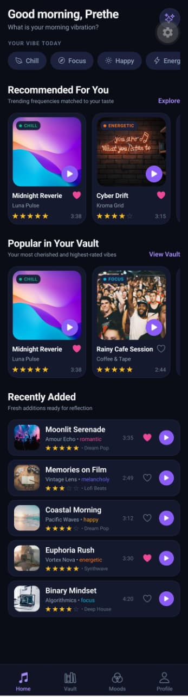
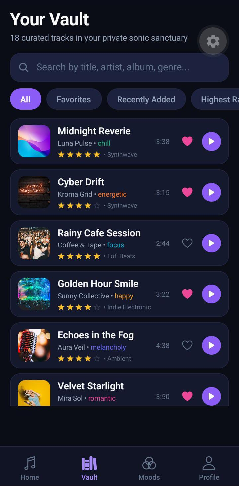
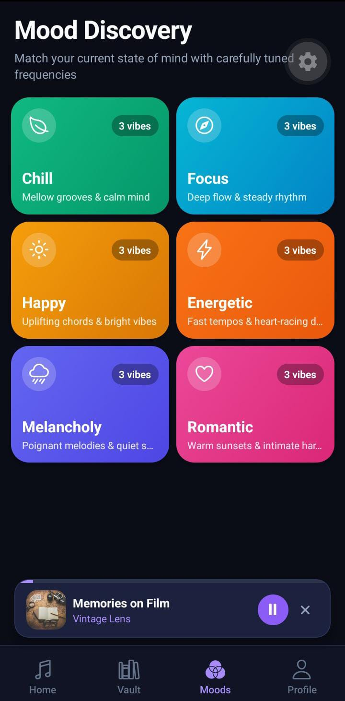
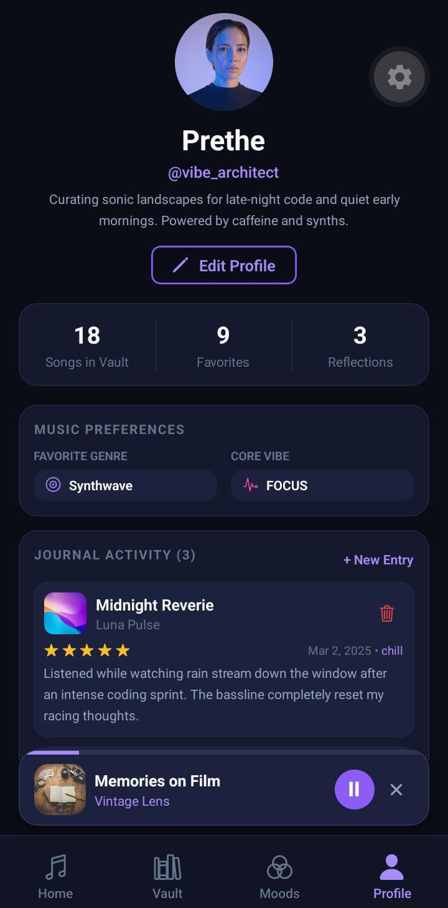

Absolutely. Here is the **complete short README in one copy-paste block**, with your screenshots and only the important project information. No mention of assessment.

````markdown
# 🎵 VibeVault

> **Your music. Your moods. Your moments.**

VibeVault is a modern music discovery and mood-journaling mobile app built with **React Native, Expo, and TypeScript**.

Users can discover songs, explore moods, save favorites, rate tracks, write personal music reflections, and interact with a simulated music player.

---

##  Screenshots

###  Home



###  Vault



###  Moods



###  Profile



---

##  Features

-  **Mood Discovery**
  - Happy
  - Chill
  - Focus
  - Energetic
  - Melancholy
  - Romantic

-  **Personal Sound Vault**
  - Search by song, artist, album, or genre
  - Favorites
  - Recently Added
  - Highest Rated

-  **Music Player**
  - Play and pause songs
  - Simulated playback progress
  - Floating MiniPlayer
  - Song Details navigation

-  **Music Journal**
  - Add personal reflections
  - Select songs and moods
  - 1–5 star ratings
  - Form validation
  - Delete journal entries

-  **Profile**
  - Listening statistics
  - Favorite genre
  - Core mood
  - Music preferences
  - Edit profile

-  **User Experience**
  - Loading states
  - Skeleton cards
  - Empty states
  - Error states
  - Retry actions
  - Toast notifications
  - Confirmation dialogs

-  **Local Persistence**
  - Favorites
  - Ratings
  - Journal entries
  - Profile information
  - App state

---

## Tech Stack

- **React Native**
- **Expo SDK 57**
- **TypeScript**
- **React Navigation**
- **Zustand**
- **React Hook Form**
- **AsyncStorage**
- **Expo Linear Gradient**
- **Expo Vector Icons**

---

## Main Screens

- Home
- Vault
- Moods
- Mood Details
- Song Details
- Add Journal Entry
- Profile
- Edit Profile

---

## Reusable Components

VibeVault uses reusable components including:

`Button` · `IconButton` · `SongCard` · `CompactSongCard` · `MoodCard` · `SearchBar` · `RatingStars` · `MiniPlayer` · `Toast` · `LoadingState` · `SkeletonCard` · `EmptyState` · `ErrorState` · `Input` · `SelectField`

---

## Project Structure

```text
vibevault/
│
├── App.tsx
├── app.json
├── package.json
├── tsconfig.json
├── README.md
│
├── assets/
│   └── icon.png
│
├── screenshots/
│   ├── home.png
│   ├── vault.png
│   ├── moods.png
│   └── profile.png
│
└── src/
    ├── types/
    ├── theme/
    ├── data/
    ├── services/
    ├── store/
    ├── hooks/
    ├── utils/
    ├── components/
    ├── navigation/
    └── screens/
````

---

##  How to Run

### 1. Install dependencies

```bash
npm install
```

### 2. Start the app

```bash
npm start
```

### 3. Run with tunnel

```bash
npx expo start --tunnel
```

### 4. Run on web

```bash
npm run web
```

### 5. Run on Android

```bash
npm run android
```

### 6. Run on iOS

```bash
npm run ios
```

> For physical device testing, open **Expo Go** and scan the QR code shown by the Expo development server.

---

##  Project Highlights

* Modern dark music-inspired UI
* Responsive mobile layouts
* Reusable component architecture
* Global state management with Zustand
* Form validation with React Hook Form
* Local persistence with AsyncStorage
* Fully local/mock music data
* Interactive simulated playback
* Mood-based music discovery
* Personal music journaling

---

## 🎵 VibeVault

**Your music. Your moods. Your moments.**

```

Available next action: :contentReference[oaicite:0]{index=0}
```
